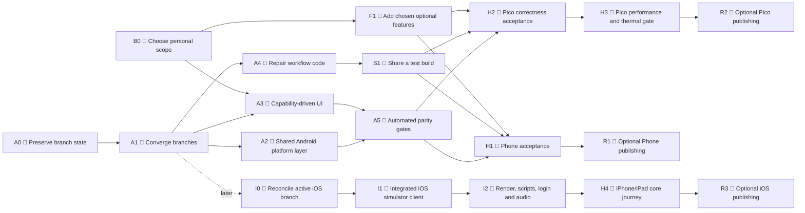
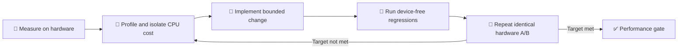

# Android Phone, Pico 4, and iOS Roadmap

> **Roadmap status:** Proposed
>
> **Assessment baseline:** 2026-08-10
>
> **Detailed evidence:** [Mobile Client Status Report](ANDROID_PHONE_PICO4_STATUS_REPORT.md)
>
> **iOS snapshot:** `feature/ios-support` at `c695f46323`; this branch is actively
> changing, so iOS checkboxes describe the inspected snapshot rather than a frozen plan.

> [!IMPORTANT]
> This is a personal roadmap for an unofficial, AI-assisted fork. The maintainer is
> currently a solo hobby developer, is not part of the official Overte development
> team, and is not presenting Android Phone, Pico 4, or iOS as official Overte interfaces.
> The upstream project has a no-AI policy; this fork exists so AI-assisted work stays
> clearly separate. The goal here is not a perfect commercial product. It is to build
> something useful and fun that works well enough for more people to experience
> Overte on more devices.

## 🎯 Project compass

1. **Working beats perfect.** Prioritize joining a domain, moving, interacting,
   communicating, and returning for another session.
2. **One maintainer means one focus.** Reduce branch drift and maintenance burden
   before expanding the feature surface.
3. **Test what can hurt the experience.** Crashes, broken input, data loss, unusable
   frame rate, overheating, and misleading controls matter more than process polish.
4. **Parity means the same useful outcome, not the same Desktop UI.** Each device
   workflow may be smaller and platform-native.
5. **Sharing is optional and incremental.** A sideloadable APK or development build
   for interested testers is already meaningful; stores and formal automation can wait.
6. **Upstream boundaries stay explicit.** Fork branding and documentation should
   prevent users from mistaking these builds for officially supported Overte clients.

## 🧭 At a glance

| Product area | Android Phone | Pico 4 | iOS |
|---|---|---|---|
| Core runtime | 🟡 Functional alpha | 🟡 Functional prototype | 🔴 Native bootstrap only |
| Build hardening | 🟢 Strong | 🟡 Good local evidence | 🟢 Strong bootstrap contracts |
| UI/platform fit | 🟢 Mostly Phone-specific | 🔴 Desktop/legacy UI exposed | 🟡 Native shell; client UI absent |
| Automated tests | 🟢 Broad device-free suite | 🟡 Good source-contract suite | 🟢 Host + simulator bootstrap CI |
| Rendering | 🟡 30 FPS short-run evidence | 🔴 About 20 new FPS | 🔴 Metal triangle, no Overte world |
| Thermal stability | 🟡 Short run only | 🔴 Safety cutoff reached | ⚪ Not measurable yet |
| Shareable build | 🔴 Handoff inconsistent | 🟡 Workflow designed | 🟡 Unsigned simulator bundle |
| Best next proof | Install and use a known APK | Comfortable Pico session | Small integrated simulator client |

### Current usability verdict

| Product | Verdict | Why |
|---|---|---|
| 📱 Android Phone | **Promising personal alpha** | Fix APK handoff, then test the core journey on a few real phones |
| 🥽 Pico 4 | **Useful prototype** | Improve frame rate/thermal behavior and remove dangerous or irrelevant UI |
| 🍎 iOS | **Strong port bootstrap** | Link the smallest Qt 6 client slice and render something from Overte |

## Legend

| Symbol | Meaning |
|---|---|
| 🟢 | Complete or strong evidence exists |
| 🟡 | Partially complete; important validation remains |
| 🔴 | Blocking defect or missing gate |
| ⚪ | Not applicable or too early to measure |
| 🤖 | Can be completed by the solo maintainer with code, CI, or an emulator |
| 👤 | Requires a personal scope choice or repository configuration |
| 📱 | Requires physical Android phone hardware |
| 🥽 | Requires physical Pico 4 hardware |
| 🍎 | Requires a macOS/Xcode environment, but not necessarily a physical device |
| 📲 | Requires a physical iPhone or iPad and Apple development signing |
| 🔐 | Optional publishing work: signing, protected environments, or a store |

## 🚦 Critical path

The critical rule is simple: **avoid maintaining the same major feature three
times. Converge Android first, let the active iOS spike reach a stable integration
point, then share mobile abstractions deliberately instead of merging by filename.**

## 🔥 P0 — Do next

These are the highest-value next actions for one maintainer. They are ordered to
produce a usable result early, not to satisfy a formal release process.

| Order | Action | Mode | Exit condition |
|---:|---|---|---|
| 1 | Preserve the two local-only Pico coverage commits | 🤖 | No local test work can be lost during branch synchronization |
| 2 | Choose one integration branch for all new work | 👤 | The old feature branches become reference points |
| 3 | Create a shared integration baseline from current Pico | 🤖 | Both products are represented in one branch |
| 4 | Resolve shared Interface/audio/settings/build ownership | 🤖 | Both device-free suites pass from the same tree |
| 5 | Repair Phone artifact naming/signing/install handoff | 🤖 | A locally or CI-built APK can actually be installed |
| 6 | Disable Pico production developer/crash actions | 🤖 | Actions are not constructible or triggerable in production |
| 7 | Replace Pico's timestamp/path asset extraction | 🤖 | Both clients use one safe content-addressed contract |
| 8 | Pick the next personally valuable Phone/Pico outcomes | 👤 | A short Now / Later / Maybe list prevents scope drift |
| 9 | Try the core journey on available and volunteer hardware | 📱 + 🥽 | Major blockers are recorded with simple reproduction steps |
| 10 | Improve Pico frame rate and thermal behavior iteratively | 🤖 + 🥽 | Sessions are comfortable and stable enough to enjoy |
| 11 | Keep the moving iOS branch isolated but periodically reconciled | 🤖 | Android convergence and iOS preparation do not silently drift apart |
| 12 | Turn the iOS bootstrap into the smallest integrated simulator client | 🤖 + 🍎 | A shared-client slice links, launches, and reaches a deterministic screen |

## Workstreams

| Workstream | Goal | Main milestones |
|---|---|---|
| 🌿 Convergence | One authoritative mobile code line | A0, A1 |
| 🧱 Platform architecture | Shared safe Android foundations | A2 |
| 🎛️ Device UI | Only meaningful and safe controls are exposed | A3, B0 |
| 🧪 Quality | Cheap automated checks plus focused device sessions | A5, H1, H2, H3 |
| ⚙️ Builds | Repeatable, installable artifacts; publishing is optional | A4, S1, R1, R2, R3 |
| 📦 Footprint | Smaller packages and review surface | A6 |
| ✨ Useful parity | Chosen platform-appropriate outcomes | F1 |
| 🍎 iOS integration | Bootstrap → shared client → first world | I0, I1, I2, H4 |

---

## Autonomous milestones

The milestones in this section can be completed without physical hardware or a new
scope choice. Builds and host/emulator tests are part of their definition of
done where the existing toolchain is available.

### A0 🤖 — Preserve and baseline

**Objective:** Make integration safe before changing branch topology.

#### Deliverables

- [ ] Preserve `b49d2750b0` and `31eb8dea8c` under explicit backup refs.
- [ ] Record the authoritative Phone and Pico remote SHAs.
- [ ] Record the current passing GitHub Actions runs.
- [ ] Create a file-ownership map for shared conflict areas.
- [ ] Mark the Phone-side Pico subtree as non-authoritative.
- [ ] Define the integration branch naming and merge policy.

#### Exit gate

> All unique work is recoverable, source ownership is explicit, and the maintainer
> no longer needs to commit new work to either old feature branch.

### A1 🤖 — Converge into one Android mobile integration branch

**Objective:** Build both Android products from one authoritative tree.

#### Integration policy

| Area | Integration rule |
|---|---|
| Pico OpenXR/WebView/input/runtime | Keep current Pico implementation |
| Phone app/16 KiB/UI/tests | Import current Phone implementation |
| Shared Interface/audio/settings/scripts | Reconcile manually by behavior |
| Phone-side stale Pico files | Never choose automatically during conflict resolution |
| Local Pico coverage work | Reapply only after review against the integrated tests |

#### Deliverables

- [ ] Create the integration branch from current `feature/pico4-support`.
- [ ] Import the Phone application and Phone-only resources.
- [ ] Resolve the 13 shared high-risk files deliberately.
- [ ] Keep Phone and Pico package IDs and build targets isolated.
- [ ] Run Phone device-free tests.
- [ ] Run Pico device-free tests.
- [ ] Run shared project/native host tests where configured.
- [ ] Document any intentional platform exceptions.

#### Exit gate

> Both clients configure and pass their complete device-free gates from one branch,
> with no stale cross-client implementation selected by accident.

### A2 🤖 — Create a shared Android platform layer

**Objective:** Replace copy-based and cross-product coupling with small, tested
platform services.

#### Deliverables

- [ ] Introduce a shared content-addressed asset-cache extractor.
- [ ] Canonicalize and constrain every extracted path.
- [ ] Reject unsafe, duplicate, unsorted, empty, and oversized manifest entries.
- [ ] Extract into a versioned directory and publish it atomically.
- [ ] Safely remove obsolete cache versions.
- [ ] Add interruption and upgrade-recovery tests.
- [ ] Move `OffscreenGLCanvas` into a shared Android override.
- [ ] Remove the Phone target's dependency on a Pico-named override.
- [ ] Replace Pico's 2,271-line `Application_Setup.cpp` fork with small hooks or
  platform policies.
- [ ] Share lifecycle, permission, and Activity-state helpers where behavior is
  truly identical.

#### Exit gate

> Shared Android behavior has one implementation, Pico-specific behavior is small
> and explicit, and update/cache behavior is deterministic across both apps.

### A3 🤖 — Make the UI capability-driven and fail closed

**Objective:** Expose only controls that are meaningful, tested, and safe for the
selected product.

#### Foundation

- [ ] Define stable platform capability IDs.
- [ ] Stop using translated display strings or regular expressions as policy keys.
- [ ] Enforce capabilities in native action handlers as well as QML presentation.
- [ ] Add regression tests for every hidden or disabled capability.

#### Android Phone cleanup

- [ ] Remove unsupported menu rows rather than suffixing them with “Unavailable”.
- [ ] Prevent direct invocation of unsupported native menu actions.
- [ ] Keep Graphics and controller graphs unconstructed.
- [ ] Audit packaged QML and scripts against actual routes.
- [ ] Keep HMD, Desktop, plugin, and crash actions explicit non-goals.

#### Pico cleanup

- [ ] Hide or remove Desktop Movement.
- [ ] Hide Sixense, Perception Neuron, Leap Motion, and unsupported controllers.
- [ ] Remove Oculus platform-login UI unless explicitly supported.
- [ ] Remove desktop snapshot-directory controls.
- [ ] Remove/no-op crash-reporting and Discord controls until configured.
- [ ] Compile- or capability-guard Developer and Crash menus.
- [ ] Remove `Debug defaultScripts.js` from production startup.
- [ ] Replace setting-based Pico detection with an immutable platform capability.
- [ ] Replace unbounded Graphics controls with validated presets and safe recovery.

#### Exit gate

> Every visible setting and action works on the current platform, and unsupported
> actions cannot be triggered through QML, scripts, localization, or direct menu APIs.

### A4 🤖 — Repair CI/CD workflow code

**Objective:** Make the repository workflows internally coherent before protected
environments, signing keys, or hardware are attached.

#### Android Phone

- [ ] Register trusted-build and emulator workflows on the default branch.
- [ ] Require release-candidate dispatch from an immutable Phone tag.
- [ ] Keep unprivileged tag/version preflight ahead of protected jobs.
- [ ] Split x86_64 debug/instrumentation acceptance from signed-channel acceptance.
- [ ] Stop treating the unsigned store-neutral APK as installable.
- [ ] Contract-test artifact names, ABI, digest, debug state, and signing state.
- [ ] Ensure release and acceptance workflows consume exactly the artifact they
  describe.

#### Pico 4

- [ ] Add an unprivileged tag/ref preflight before the signing runner.
- [ ] Ensure mutable refs cannot reach release secrets or execute on the release
  runner.
- [ ] Contract-test trusted build, RC, draft release, and device handoff together.
- [ ] Correct the malformed line in the release checklist.

#### iOS

- [x] Keep credential-free host, simulator, and unsigned device-SDK jobs separate.
- [x] Build, verify, launch, package, and checksum the native bootstrap in CI.
- [ ] Add a distinct experimental full-client job when I1 can configure reliably.
- [ ] Keep bootstrap success from masking integrated-client failures.
- [ ] Preserve simulator diagnostics and source/artifact identity for each attempt.

#### Exit gate

> Workflow contract tests prove the complete artifact identity chain without using
> secrets, physical devices, or destructive external actions.

### A5 🤖 — Add automated parity and regression gates

**Objective:** Prevent Desktop/Quest residue and unsupported functionality from
silently returning.

#### Deliverables

- [ ] Extend the machine-readable capability matrix across all three clients.
- [ ] Map every retained app, setting, menu, and runtime boundary to tests.
- [ ] Add Phone emulator tests for launcher, deep link, IME, Back, and lifecycle.
- [ ] Add Phone route tests for every retained tablet app.
- [ ] Add Pico Settings and menu snapshots/contracts.
- [ ] Add a test that rejects production crash/developer actions.
- [ ] Add Pico cache-upgrade and stale-asset tests.
- [x] Keep iOS bootstrap CLI, bundle, lifecycle, deep-link, dependency, compatibility,
  SBOM, and device-result contracts in the host tier.
- [ ] Add iOS full-client gates incrementally as each integrated boundary becomes real.
- [ ] Integrate the preserved local native-coverage commits where still applicable.
- [ ] Clearly separate source-contract, emulator, and physical-device evidence in
  reports.

#### Exit gate

> A new Desktop option, menu, script, or dependency cannot become part of a mobile
> client without an explicit capability and test update.

### A6 🤖 — Reduce package and repository footprint

**Objective:** Lower APK size, attack surface, dependency cost, and review noise.

#### Android Phone

- [ ] Convert remaining script packaging to a positive allowlist.
- [ ] Audit shared `resources.rcc` reachability.
- [ ] Exclude unused desktop/HMD QML where selectors and runtime allow it.
- [ ] Re-measure the APK and native closure after each trim.

#### Pico 4

- [ ] Stop packaging the full developer tree.
- [ ] Stop packaging community and tutorial trees without product consumers.
- [ ] Remove unused Qt Contacts, DocGallery, Organizer, Feedback, and Versit
  libraries after dependency verification.
- [ ] Audit legacy Quest resources and selectors.
- [ ] Establish an APK size budget.

#### Repository hygiene

- [ ] Deduplicate repeated serverless-world fixtures.
- [ ] Replace giant chronological nightly documents with compact status reports and
  CI artifacts.
- [ ] Keep immutable raw test evidence outside product-source diffs where possible.

#### Exit gate

> Both APKs have documented budgets, every packaged component has a consumer, and
> status documentation remains reviewable.

### I0 🤖 — Track and prepare the active iOS branch

**Objective:** Preserve momentum in the separate iOS worktree without prematurely
mixing a fast-moving bootstrap into Android convergence.

#### Deliverables

- [ ] Record the iOS baseline SHA whenever roadmap assumptions are refreshed.
- [ ] Keep bootstrap-only and integrated-client evidence clearly separated.
- [ ] Group iOS changes into platform shell, shared compatibility, dependencies,
  tests, and documentation so they can be reconciled intentionally later.
- [ ] Compare shared CMake, Interface, Web, audio, scripts, and UI changes against the
  chosen Android integration baseline before merging either direction.
- [ ] Reuse concepts such as capabilities, safe paths, lifecycle state, and touch UX;
  do not copy Android-specific APIs into iOS.
- [ ] Defer final convergence until the iOS branch can link a meaningful shared-client
  slice or reaches another deliberate synchronization point.

#### Exit gate

> The iOS work remains recoverable and understandable, its shared-source conflicts
> are known, and ongoing iOS experimentation is not blocked by Android cleanup.

---

## Personal choices and hardware milestones

These milestones need either a quick choice by the maintainer or time with real
hardware. They are not external approvals. Choose the smallest scope that sounds
fun and useful now; everything else can remain in Later or Maybe.

### B0 👤 — Choose the next useful outcomes

This is a personal scope exercise, not a permanent product contract. Revisit it
whenever priorities or available hardware change.

#### Android Phone

- [ ] Explore/social client only, or creator client as well?
- [ ] Would touch-owned Create add more value now than polishing Explore/social use?
- [ ] Is portrait orientation required?
- [ ] Is the sustained target 30 FPS, 60 FPS, or device-tiered?
- [ ] Are snapshots required, and which Android storage flow should own them?
- [ ] May More/Community download or install third-party scripts?
- [ ] Is an external avatar marketplace allowed?
- [ ] Keep diagnostics local, or deliberately opt into a privacy-respecting crash flow?
- [ ] F-Droid, Play, direct download, or multiple channels?

#### Pico 4

- [ ] Must Overte generate 72 new FPS, or is a measured reprojection target allowed?
- [ ] Which sustained temperature and battery limits are acceptable?
- [ ] Is WebChannel/EventBridge required for release?
- [ ] Which origins may call native/entity APIs?
- [ ] Which external controllers or trackers are worth personal experiment time?
- [ ] Are mirror, secondary camera, and full Create import mandatory?
- [ ] Consumer Store, Business Store, direct APK, or multiple channels?

#### iOS

- [ ] Is the first goal iPhone, iPad, or whichever form factor becomes usable first?
- [ ] Is “login and walk around one domain” enough for the first useful client?
- [ ] Which Phone touch/UI ideas are worth adapting rather than reimplementing now?
- [ ] Is MoltenVK acceptable if it is correct and good enough, even if native Metal
  could eventually be faster?
- [ ] Which system scripts are truly required for the first connected session?
- [ ] Is access to a Mac, cloud macOS CI, an iPhone, or an iPad currently available?
- [ ] Keep development builds private, share with a few testers, or consider TestFlight
  only much later?
- [ ] What fork-specific app name, bundle ID, icon treatment, and URL-scheme policy
  make the unofficial status unmistakable?

#### Exit gate

> Each client has a one-page **Now / Later / Maybe / Not planned** list. “Now” stays
> small enough for one person to finish and test.

### S1 👤 — Make builds easy to share with testers

This is intentionally lightweight. It is enough to hand a known Android APK or iOS
development build to a willing tester and understand which source produced it.

- [ ] Produce clearly named Phone/Pico APKs and iOS artifacts from a recorded commit.
- [ ] Document OS version, architecture, install steps, and known limitations.
- [ ] Include “unofficial fork” and “not supported by the Overte team” in the build
  description and About/help surface where practical.
- [ ] Give shared iOS builds a fork-owned bundle identifier and decide whether they
  should claim `overte`/`hifi` URL schemes or coexist with another client.
- [ ] Keep a tiny feedback template: device, OS, build SHA, steps, expected, actual.
- [ ] Never put signing keys or device credentials into the repository.
- [ ] Prefer local/debug or disposable test signing until a real distribution channel
  is worth the maintenance cost.

#### Optional automation

- [ ] Upload CI artifacts when this saves time compared with local builds.
- [ ] Add checksums and a short changelog for externally shared artifacts.
- [ ] Use immutable tags only when calling a build a versioned public release.

#### Exit gate

> Another person can install the intended build, identify its exact source revision,
> understand that it is unofficial, and return a useful bug report.

### H1 📱 — Android Phone hardware acceptance

#### Suggested coverage over time

Do not buy a device matrix just to satisfy this table. Start with available hardware,
then use volunteer reports to broaden coverage when possible.

| Dimension | Useful eventual coverage |
|---|---|
| GPU | One Adreno and one Mali device |
| Android | One API 26–29 and one API 30+ device |
| Display | Flat plus notch/hole-punch/rounded or asymmetric display |
| Network | Wi-Fi, mobile data, transition, loss, and reconnect |
| Session | Cold start, background/foreground, process recreation, 30–60 minute soak |

#### Core journeys

- [ ] Clean install and cold launch.
- [ ] Microphone allow and deny.
- [ ] Account login success, invalid credentials, cancellation, and logout.
- [ ] Domain login.
- [ ] IME resize, focus, gesture Back, and physical Back.
- [ ] Deep links before and after native runtime readiness.
- [ ] Audio input/output, mute, routing, and levels.
- [ ] Tablet open/home/close cycles for every retained application.
- [ ] No touch-through from tablet into world controls.
- [ ] People, Places, Avatar, Shield, and Emote success/error paths.
- [ ] Network transition and reconnect.
- [ ] Cutout, safe inset, DPI, and system-bar behavior.
- [ ] 30–60 minute populated-domain thermal/battery/audio/network soak.

#### Exit gate

> The core journey is enjoyable on available hardware, with no known critical UI,
> lifecycle, audio, networking, or rendering defect. Cross-GPU evidence is a bonus
> gained through volunteer testing, not a prerequisite for continued development.

### H2 🥽 — Pico correctness acceptance

#### OpenXR and input

- [ ] Both controllers and both hands.
- [ ] Trigger, grip, and sticks across tracking loss and recovery.
- [ ] Suspend/resume with controls held.
- [ ] Immediate neutral state and safe release.
- [ ] No stale click, grab, locomotion, scroll, or haptic state.

#### Interaction and Create

- [ ] Near/Far Grab with both hands.
- [ ] Rapid target changes.
- [ ] Off-hand rotation.
- [ ] Local and domain-hosted entities.
- [ ] Entity List and import.
- [ ] Mirror and secondary camera if retained.
- [ ] Long editing session.

#### Web entities

- [ ] Opaque and transparent pages.
- [ ] Transparent-centre content.
- [ ] Hover, click, drag, scroll, and pressed-target loss.
- [ ] Repeated resize, navigation, and destruction.
- [ ] Multiple WebView isolation.
- [ ] JNI/WebView log review.

#### Audio and lifecycle

- [ ] Rapid source switching and restart isolation.
- [ ] Fixed-phrase speech quality.
- [ ] AEC and echo evaluation.
- [ ] Sustained capture under automatic fan control.
- [ ] Activity background/resume and world reconnect.

#### Exit gate

> All mandatory XR, interaction, Create, Web, audio, and lifecycle journeys pass
> without stale state, crash, or unrecoverable degradation.

### H3 🥽 — Pico performance and thermal gate

**This is the highest-value Pico quality milestone:** poor frame pacing or thermal
cutoffs directly prevent enjoyable sessions, even for a personal build.

#### Test scenes

- [ ] Current live Hub baseline.
- [ ] Controlled moving-avatar population.
- [ ] Independent mixer-fed moving avatars.
- [ ] Mirror-heavy or secondary-camera scene.
- [ ] Create editing workload.
- [ ] Active Web entity workload if Web is in release scope.

#### Measurements

- [ ] Application-generated frame rate.
- [ ] Compositor presents and reprojection behavior.
- [ ] Frame pacing and dropped/new frames.
- [ ] Per-thread CPU and blocking hotspots.
- [ ] GPU frame time and clock.
- [ ] Controller-to-object and ray latency.
- [ ] CPU, GPU, skin, and battery temperature.
- [ ] Battery drain and fan behavior.
- [ ] 30–60 minute automatic-fan stability.

#### Optimization loop

#### Exit gate

> The personally chosen native-frame or reprojection target is sustained for 30–60 minutes,
> interaction latency is acceptable, and no thermal safety cutoff or progressive
> throttling occurs under automatic fan control.

### I1 🍎 — Build the smallest integrated iOS simulator client

**Objective:** Cross the boundary from a well-tested native bootstrap to real shared
Overte code. This needs macOS/Xcode or the existing macOS CI, but no physical device.

#### Keep the already working bootstrap green

- [ ] Linux host contracts pass.
- [ ] Unsigned arm64 `iphoneos` bundle compiles and verifies.
- [ ] iPhone and iPad simulator builds launch and survive the smoke window.
- [ ] Metal library, bundle metadata, privacy manifest, and architecture checks pass.

#### Integrated slice

- [ ] Resolve the simulator Conan graph on macOS with host tools separated.
- [ ] Configure `OVERTE_IOS_BOOTSTRAP_ONLY=OFF` and capture the first deterministic
  failure phase.
- [ ] Retire Qt 5 CMake and Core5Compat debt only where it blocks the selected slice.
- [ ] Convert only the required plug-ins to static registration.
- [ ] Exclude Desktop launchers, servers, installers, HMD paths, OpenGL presentation,
  and dynamic plug-in packaging from the iOS graph.
- [ ] Link shared application/platform code into an iOS bundle.
- [ ] Launch to a deterministic integrated screen in both simulator form factors.

#### Exit gate

> The simulator runs code from the shared Overte client rather than only the native
> triangle bootstrap, and the remaining failures are a bounded backlog instead of an
> unknown build graph.

### I2 🍎 — Reach the first connected iOS journey

**Objective:** Turn the integrated shell into something recognizably useful before
expanding settings, tablet apps, or publishing work.

#### Rendering and content

- [ ] Use MoltenVK to render the representative scene, or record a correctness reason
  that requires a native Metal backend.
- [ ] Load textures, models, avatars, text, transparency, and resized render targets.
- [ ] Keep caches and writable state inside Apple-provided containers.

#### Runtime and interaction

- [ ] Supply and audit a static arm64 non-JIT V8/libnode package.
- [ ] Start the minimum system-script set without executable-memory permissions.
- [ ] Adapt touch movement, camera control, text entry, and safe-area behavior.
- [ ] Implement login, domain connection, deep-link delivery, network loss, and
  reconnect.
- [ ] Connect Qt 6 audio output/input to the native `AVAudioSession` policy.
- [ ] Expose only the minimum capability-filtered tablet/settings surface.

#### Exit gate

> On iPhone and iPad simulators, the app can reach the login/domain path, render an
> Overte-controlled scene, accept useful input, and start the required scripts. Audio
> APIs are connected even though final microphone and route quality need hardware.

### H4 📲 — iPhone/iPad core-journey session

Start with whichever personally available Apple device can run the build. Broader
iPhone/iPad coverage can come from volunteers; owning both is not a prerequisite.

- [ ] Sign and install a development build without committing Apple credentials.
- [ ] Launch, log in, connect to a domain, move, look, type, and reconnect.
- [ ] Render a representative world and avatars with usable frame pacing.
- [ ] Verify speaker/headphone/Bluetooth routing and microphone consent/capture.
- [ ] Exercise interruption, background/foreground, rotation, memory pressure, and
  temporary network loss.
- [ ] Check safe areas, Dynamic Type, Reduce Motion, VoiceOver, and iPad resizing where
  the available device supports them.
- [ ] Run a 30-minute session and record memory, battery, and thermal behavior.
- [ ] Record device, OS, source SHA, bundle hash, failures, and concise evidence.

#### Exit gate

> The first connected journey is enjoyable on at least one real Apple device, with
> known limitations documented. A second form factor is useful volunteer evidence,
> not a reason to block continued hobby development.

### R1 🔐📱 — Optional Android Phone publishing

Skip this milestone until direct test APKs are useful and maintaining a public
distribution channel sounds worthwhile.

#### Deliverables

- [ ] All autonomous milestones complete.
- [ ] B0 scope chosen and S1 sharing flow proven.
- [ ] H1 hardware acceptance complete.
- [ ] Immutable release tag and monotonic version code.
- [ ] Store-neutral reproducibility candidate generated.
- [ ] Actual channel artifact signed with a securely retained key.
- [ ] Exact signed artifact passes package, 16 KiB, digest, signer, and device gates.
- [ ] F-Droid recipe or other selected distribution flow reviewed.
- [ ] A simple rollback/fix-forward and key-backup procedure exists.

#### Exit gate

> The exact bytes intended for users are signed, traceable to the reviewed source,
> hardware-tested, clearly unofficial, and distributed through a deliberately chosen
> channel that remains manageable for one maintainer.

### R2 🔐🥽 — Optional Pico 4 publishing

Skip this milestone until sideloaded builds are stable enough that store or wider
distribution would genuinely help users.

#### Deliverables

- [ ] All autonomous milestones complete.
- [ ] B0 scope chosen and S1 sharing flow proven.
- [ ] H2 and H3 hardware gates complete.
- [ ] Trusted build succeeds from a clean checkout.
- [ ] Signed RC workflow succeeds from an immutable tag.
- [ ] Draft release metadata, SBOM, checksums, and provenance reviewed.
- [ ] Exact signed APK passes protected device acceptance.
- [ ] PICO portal confirms package ownership and current APK-size limit.
- [ ] If using a store, its regions, OS versions, controller declarations,
  permissions, UGC, age rating, privacy, licenses, and signing rules are understood.

#### Exit gate

> A signed Pico artifact is reproducible, hardware-tested, clearly unofficial, and
> compatible with the chosen distribution path. A direct sideload remains a valid
> endpoint for this hobby project.

### R3 🔐📲 — Optional iOS publishing

Skip this until a development-signed build is genuinely useful on hardware.
TestFlight or the App Store adds account, signing, privacy, review, and maintenance
work; none of it is required to prove the port or enjoy a personal build.

- [ ] Choose a unique unofficial-fork bundle identifier and visible attribution.
- [ ] Retain the signing key and account recovery information securely outside Git.
- [ ] Generate and review Xcode's aggregated privacy report.
- [ ] Confirm required-reason APIs, permissions, downloaded scripts/content, and
  account behavior match the declared privacy manifest.
- [ ] Verify archive contents contain only static, permitted native code.
- [ ] Use TestFlight first if broader testing is worth the ongoing effort.
- [ ] Document supported devices/OS versions and known limitations honestly.

#### Exit gate

> The chosen Apple distribution path remains manageable for one maintainer, users
> can tell the client is an unofficial fork, and publication creates more value than
> maintenance burden.

---

## Optional feature milestone

### F1 🤖 after B0 — Implement chosen useful parity

Start an item only after choosing it for “Now.” Useful outcomes matter more than
matching every Desktop feature, while final confidence comes from H1, H2, or H4.

#### Candidate Phone features

| Feature | Required design boundary |
|---|---|
| Touch-owned Create | Screen-space selection, editing, dialogs, import, undo, and lifecycle; do not wrap Desktop Create wholesale |
| Snapshots | Android storage/media APIs; no desktop directory picker |
| More/Community | Provenance, signatures, origin policy, sandbox, revocation, and user consent |
| Avatar marketplace | Approved remote-content and browser boundary |
| Portrait | WindowInsets transport, responsive layouts, world controls, IME, and rotation lifecycle |

#### Candidate Pico features

| Feature | Required design boundary |
|---|---|
| WebChannel/EventBridge | Reviewed origin/frame policy and narrow native API protocol |
| Full Create import | File/content provider, archive safety, lifecycle, and controller UX |
| External trackers/controllers | Explicit support matrix and fail-closed input state |
| Mirror/secondary camera | Measured performance budget and comfort review |

#### Candidate iOS features

| Feature | Required design boundary |
|---|---|
| More tablet apps | Enable one at a time through explicit iOS capabilities |
| World Web content | WKWebView origin, authentication, permission, and bridge policy |
| Snapshots/import | Photos or document-picker UX inside Apple container rules |
| Create | Touch-first selection/editing; do not expose Desktop panels wholesale |
| Camera/haptics | Explicit permission, privacy, lifecycle, and battery behavior |
| Background audio | Add only for a clear user journey and Apple policy fit |

#### Exit gate

> Every chosen feature has a platform-owned UX, explicit security boundary,
> automated contracts, and an appropriate real-device session where needed.

## Suggested execution waves

| Wave | Milestones | Outcome |
|---|---|---|
| 0 — Stabilize | A0, B0 kickoff, I0 | Work preserved; a small personal scope is visible |
| 1 — Converge Android | A1 | One Android mobile source line |
| 2 — Harden | A2, A3, A4 | Safe shared core, clean UI, coherent workflows |
| 3 — Prove | A5, A6, S1 | Automated checks, smaller packages, shareable APKs |
| 4 — Cross iOS boundary | I1 | Shared client launches in Apple simulators |
| 5 — Validate Android | H1, H2 | Phone and Pico correctness evidence |
| 6 — Connect iOS | I2 | First simulated login/world/input path |
| 7 — Optimize | H3 | Pico becomes comfortable enough for longer sessions |
| 8 — Try iOS hardware | H4 | Core journey works on an available Apple device |
| 9 — Add value | F1 where chosen | Platform-appropriate useful parity |
| 10 — Publish, optionally | R1, R2, R3 | Signed public builds if worthwhile |

## Progress dashboard

### Shared gates

- [ ] One authoritative Android integration branch and a documented iOS
  reconciliation point.
- [ ] Phone and Pico device-free suites pass from the same Android commit.
- [ ] Shared Android cache and lifecycle foundations.
- [ ] Capability-based Settings and Menu policies.
- [ ] No production Developer/Crash actions.
- [ ] Workflow artifact identity is coherent and tested.
- [ ] Package footprint and dependency inventory reviewed.

### Android Phone gates

- [ ] Trusted build registered and passing.
- [ ] Installable emulator/instrumentation lane passing.
- [ ] Signed-channel artifact acceptance passing.
- [ ] Available-device session passing; Adreno/Mali reports collected over time.
- [ ] 30–60 minute interactive soak passing.
- [ ] A shareable APK and installation notes exist.

### Pico 4 gates

- [ ] Trusted build passing.
- [ ] Signed RC draft workflow passing.
- [ ] Protected device acceptance passing.
- [ ] Both-hand/tracking-loss/Create/Web/audio correctness passing.
- [ ] Sustained performance target passing.
- [ ] Automatic-fan thermal soak passing.
- [ ] A shareable APK and installation notes exist.

### iOS gates

- [x] Native bootstrap builds and launches in iPhone and iPad simulators.
- [x] Unsigned arm64 device-SDK bundle compiles at the assessed branch head.
- [ ] Full-client dependency graph resolves on macOS.
- [ ] A shared-client slice links and launches in both simulators.
- [ ] Representative Overte scene renders through the chosen backend.
- [ ] Non-JIT scripts, login/domain connection, touch, and Qt 6 audio are connected.
- [ ] Core journey works on one available physical iPhone or iPad.
- [ ] Development build sharing notes exist; TestFlight/App Store remains optional.

## Three sensible finish lines

This project does not need one heavyweight definition of done. Use the finish line
that matches the current goal:

### 1. Works for me

- The core journey works on the maintainer's available hardware.
- No known crash, dangerous control, overheating loop, or data-loss issue blocks a
  normal session.
- Known limitations are written down.

### 2. Shareable community build

- Another person can install a revision-identifiable build and complete the core
  journey.
- The build is clearly labeled as an unofficial fork with no official Overte support.
- Feedback is reproducible enough to guide the next hobby session.

### 3. Distribution-ready, only if desired

If wider publishing becomes worthwhile, then apply the stricter checks below:

1. **Source:** The exact source is immutable, reviewed, and built from the shared
   integration line.
2. **Build:** Dependencies, package contents, ABI, version, and provenance are
   reproducible and verified.
3. **Security:** Platform UI is fail closed, dangerous actions are unavailable, and
   remote-content boundaries are explicit.
4. **Correctness:** Automated, emulator, and physical-device gates cover the product's
   mandatory journeys.
5. **Performance:** Sustained hardware targets pass without unacceptable latency,
   thermal cutoff, or battery behavior.
6. **Artifact:** The exact signed bytes intended for users pass final acceptance.
7. **Operations:** Signing, rollback/fix-forward, key recovery, privacy, and the
   chosen distribution process are documented at a maintainable level.

A green device-free CI run is useful evidence, not a substitute for trying the build.
Conversely, a fun and stable sideloaded build can be a success without satisfying
store-grade process requirements.
