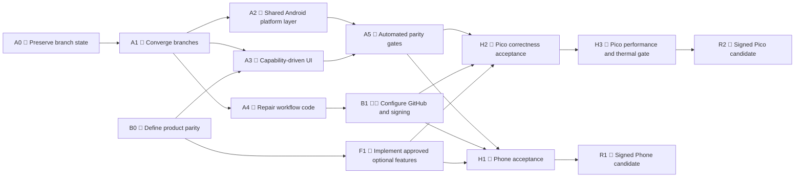
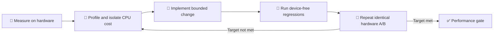

# Android Phone and Pico 4 Roadmap

> **Roadmap status:** Proposed
>
> **Assessment baseline:** 2026-08-10
>
> **Detailed evidence:** [Android Phone and Pico 4 Status Report](ANDROID_PHONE_PICO4_STATUS_REPORT.md)

## 🧭 At a glance

| Product area | Android Phone | Pico 4 | Release gate |
|---|---|---|---|
| Core runtime | 🟡 Functional alpha | 🟡 Functional prototype | Representative hardware acceptance |
| Build hardening | 🟢 Strong | 🟡 Good local evidence | Clean trusted-build execution |
| UI/platform fit | 🟢 Mostly Phone-specific | 🔴 Desktop/legacy UI exposed | Capability-driven UI |
| Automated tests | 🟢 Broad device-free suite | 🟡 Good source-contract suite | Runtime/emulator coverage |
| Performance | 🟡 30 FPS short-run evidence | 🔴 About 20 new FPS | Agreed sustained performance target |
| Thermal stability | 🟡 Short run only | 🔴 Safety cutoff reached | 30–60 minute automatic-fan soak |
| Release automation | 🔴 Blocked/inconsistent | 🟡 Designed, never completed | End-to-end candidate run |
| Distribution | 🟡 F-Droid-first concept | 🔴 No channel approved | Signing, ownership, portal approval |

### Current release verdict

| Product | Verdict | Why |
|---|---|---|
| 📱 Android Phone | **No-go for public alpha** | Installable RC acceptance is broken; interactive device matrix is incomplete |
| 🥽 Pico 4 | **No-go for release candidate** | Frame rate, thermal behavior, production UI, and release-chain blockers |

## Legend

| Symbol | Meaning |
|---|---|
| 🟢 | Complete or strong evidence exists |
| 🟡 | Partially complete; important validation remains |
| 🔴 | Blocking defect or missing gate |
| 🤖 | Can be completed autonomously without product input or physical hardware |
| 👤 | Requires maintainer/product input or repository administration |
| 📱 | Requires physical Android phone hardware |
| 🥽 | Requires physical Pico 4 hardware |
| 🔐 | Requires signing, protected environments, or distribution ownership |

## 🚦 Critical path

The critical rule is simple: **do not add major product features to both divergent
branches. Converge first, then implement against one shared mobile baseline.**

## 🔥 P0 — Do next

These actions should start before new Phone or Pico feature work.

| Order | Action | Mode | Exit condition |
|---:|---|---|---|
| 1 | Preserve the two local-only Pico coverage commits | 🤖 | No local test work can be lost during branch synchronization |
| 2 | Freeze feature work on the two divergent branches | 👤 | New work targets the integration branch only |
| 3 | Create a shared integration baseline from current Pico | 🤖 | Both products are represented in one branch |
| 4 | Resolve shared Interface/audio/settings/build ownership | 🤖 | Both device-free suites pass from the same tree |
| 5 | Repair Phone tag dispatch and artifact handoff | 🤖 + 👤 | Workflow code is valid and environment permits protected tags |
| 6 | Disable Pico production developer/crash actions | 🤖 | Actions are not constructible or triggerable in production |
| 7 | Replace Pico's timestamp/path asset extraction | 🤖 | Both clients use one safe content-addressed contract |
| 8 | Agree Phone/Pico parity and performance targets | 👤 | Must-have, optional, and non-goal lists are approved |
| 9 | Execute representative hardware correctness gates | 📱 + 🥽 | Core flows pass on the required device matrix |
| 10 | Resolve Pico frame-rate and thermal blockers | 🤖 + 🥽 | Sustained hardware targets pass |

## Workstreams

| Workstream | Goal | Main milestones |
|---|---|---|
| 🌿 Convergence | One authoritative mobile code line | A0, A1 |
| 🧱 Platform architecture | Shared safe Android foundations | A2 |
| 🎛️ Product UI | Only meaningful and safe controls are exposed | A3, B0 |
| 🧪 Quality | Automated contracts plus honest hardware gates | A5, H1, H2, H3 |
| ⚙️ CI/CD | Reproducible, installable, signed candidates | A4, B1, R1, R2 |
| 📦 Footprint | Smaller packages and review surface | A6 |
| ✨ Feature parity | Approved platform-appropriate features | F1 |

---

## Autonomous milestones

The milestones in this section can be completed without physical hardware or a new
product decision. Builds and host/emulator tests are part of their definition of
done where the existing toolchain is available.

### A0 🤖 — Preserve and baseline

**Objective:** Make integration safe before changing branch topology.

#### Deliverables

- [ ] Preserve `b49d2750b0` and `31eb8dea8c` under explicit backup refs.
- [ ] Record the authoritative Phone and Pico remote SHAs.
- [ ] Record the current passing GitHub Actions runs.
- [ ] Create a file-ownership map for shared conflict areas.
- [ ] Mark the Phone-side Pico subtree as non-authoritative.
- [ ] Define the integration branch naming and merge policy.

#### Exit gate

> All unique work is recoverable, source ownership is explicit, and no developer
> needs to commit new product work to either old feature branch.

### A1 🤖 — Converge into one mobile integration branch

**Objective:** Build both Android products from one authoritative tree.

#### Integration policy

| Area | Integration rule |
|---|---|
| Pico OpenXR/WebView/input/runtime | Keep current Pico implementation |
| Phone app/16 KiB/UI/tests | Import current Phone implementation |
| Shared Interface/audio/settings/scripts | Reconcile manually by behavior |
| Phone-side stale Pico files | Never choose automatically during conflict resolution |
| Local Pico coverage work | Reapply only after review against the integrated tests |

#### Deliverables

- [ ] Create the integration branch from current `feature/pico4-support`.
- [ ] Import the Phone application and Phone-only resources.
- [ ] Resolve the 13 shared high-risk files deliberately.
- [ ] Keep Phone and Pico package IDs and build targets isolated.
- [ ] Run Phone device-free tests.
- [ ] Run Pico device-free tests.
- [ ] Run shared project/native host tests where configured.
- [ ] Document any intentional platform exceptions.

#### Exit gate

> Both clients configure and pass their complete device-free gates from one branch,
> with no stale cross-client implementation selected by accident.

### A2 🤖 — Create a shared Android platform layer

**Objective:** Replace copy-based and cross-product coupling with small, tested
platform services.

#### Deliverables

- [ ] Introduce a shared content-addressed asset-cache extractor.
- [ ] Canonicalize and constrain every extracted path.
- [ ] Reject unsafe, duplicate, unsorted, empty, and oversized manifest entries.
- [ ] Extract into a versioned directory and publish it atomically.
- [ ] Safely remove obsolete cache versions.
- [ ] Add interruption and upgrade-recovery tests.
- [ ] Move `OffscreenGLCanvas` into a shared Android override.
- [ ] Remove the Phone target's dependency on a Pico-named override.
- [ ] Replace Pico's 2,271-line `Application_Setup.cpp` fork with small hooks or
  platform policies.
- [ ] Share lifecycle, permission, and Activity-state helpers where behavior is
  truly identical.

#### Exit gate

> Shared Android behavior has one implementation, Pico-specific behavior is small
> and explicit, and update/cache behavior is deterministic across both apps.

### A3 🤖 — Make the UI capability-driven and fail closed

**Objective:** Expose only controls that are meaningful, tested, and safe for the
selected product.

#### Foundation

- [ ] Define stable platform capability IDs.
- [ ] Stop using translated display strings or regular expressions as policy keys.
- [ ] Enforce capabilities in native action handlers as well as QML presentation.
- [ ] Add regression tests for every hidden or disabled capability.

#### Android Phone cleanup

- [ ] Remove unsupported menu rows rather than suffixing them with “Unavailable”.
- [ ] Prevent direct invocation of unsupported native menu actions.
- [ ] Keep Graphics and controller graphs unconstructed.
- [ ] Audit packaged QML and scripts against actual routes.
- [ ] Keep HMD, Desktop, plugin, and crash actions explicit non-goals.

#### Pico cleanup

- [ ] Hide or remove Desktop Movement.
- [ ] Hide Sixense, Perception Neuron, Leap Motion, and unsupported controllers.
- [ ] Remove Oculus platform-login UI unless explicitly supported.
- [ ] Remove desktop snapshot-directory controls.
- [ ] Remove/no-op crash-reporting and Discord controls until configured.
- [ ] Compile- or capability-guard Developer and Crash menus.
- [ ] Remove `Debug defaultScripts.js` from production startup.
- [ ] Replace setting-based Pico detection with an immutable platform capability.
- [ ] Replace unbounded Graphics controls with validated presets and safe recovery.

#### Exit gate

> Every visible setting and action works on the current platform, and unsupported
> actions cannot be triggered through QML, scripts, localization, or direct menu APIs.

### A4 🤖 — Repair CI/CD workflow code

**Objective:** Make the repository workflows internally coherent before protected
environments, signing keys, or hardware are attached.

#### Android Phone

- [ ] Register trusted-build and emulator workflows on the default branch.
- [ ] Require release-candidate dispatch from an immutable Phone tag.
- [ ] Keep unprivileged tag/version preflight ahead of protected jobs.
- [ ] Split x86_64 debug/instrumentation acceptance from signed-channel acceptance.
- [ ] Stop treating the unsigned store-neutral APK as installable.
- [ ] Contract-test artifact names, ABI, digest, debug state, and signing state.
- [ ] Ensure release and acceptance workflows consume exactly the artifact they
  describe.

#### Pico 4

- [ ] Add an unprivileged tag/ref preflight before the signing runner.
- [ ] Ensure mutable refs cannot reach release secrets or execute on the release
  runner.
- [ ] Contract-test trusted build, RC, draft release, and device handoff together.
- [ ] Correct the malformed line in the release checklist.

#### Exit gate

> Workflow contract tests prove the complete artifact identity chain without using
> secrets, physical devices, or destructive external actions.

### A5 🤖 — Add automated parity and regression gates

**Objective:** Prevent Desktop/Quest residue and unsupported functionality from
silently returning.

#### Deliverables

- [ ] Create a machine-readable capability matrix for both products.
- [ ] Map every retained app, setting, menu, and runtime boundary to tests.
- [ ] Add Phone emulator tests for launcher, deep link, IME, Back, and lifecycle.
- [ ] Add Phone route tests for every retained tablet app.
- [ ] Add Pico Settings and menu snapshots/contracts.
- [ ] Add a test that rejects production crash/developer actions.
- [ ] Add Pico cache-upgrade and stale-asset tests.
- [ ] Integrate the preserved local native-coverage commits where still applicable.
- [ ] Clearly separate source-contract, emulator, and physical-device evidence in
  reports.

#### Exit gate

> A new Desktop option, menu, script, or dependency cannot become part of either
> mobile product without an explicit capability and test update.

### A6 🤖 — Reduce package and repository footprint

**Objective:** Lower APK size, attack surface, dependency cost, and review noise.

#### Android Phone

- [ ] Convert remaining script packaging to a positive allowlist.
- [ ] Audit shared `resources.rcc` reachability.
- [ ] Exclude unused desktop/HMD QML where selectors and runtime allow it.
- [ ] Re-measure the APK and native closure after each trim.

#### Pico 4

- [ ] Stop packaging the full developer tree.
- [ ] Stop packaging community and tutorial trees without product consumers.
- [ ] Remove unused Qt Contacts, DocGallery, Organizer, Feedback, and Versit
  libraries after dependency verification.
- [ ] Audit legacy Quest resources and selectors.
- [ ] Establish an APK size budget.

#### Repository hygiene

- [ ] Deduplicate repeated serverless-world fixtures.
- [ ] Replace giant chronological nightly documents with compact status reports and
  CI artifacts.
- [ ] Keep immutable raw test evidence outside product-source diffs where possible.

#### Exit gate

> Both APKs have documented budgets, every packaged component has a consumer, and
> status documentation remains reviewable.

---

## Input, administration, and hardware milestones

These milestones cannot be completed autonomously because they require a product
decision, privileged repository configuration, signing authority, or physical
hardware.

### B0 👤 — Approve the platform product contracts

**Decisions required from maintainers/product owners:**

#### Android Phone

- [ ] Explore/social client only, or creator client as well?
- [ ] Is touch-owned Create a release requirement?
- [ ] Is portrait orientation required?
- [ ] Is the sustained target 30 FPS, 60 FPS, or device-tiered?
- [ ] Are snapshots required, and which Android storage flow should own them?
- [ ] May More/Community download or install third-party scripts?
- [ ] Is an external avatar marketplace allowed?
- [ ] Which crash reporting, telemetry, and privacy policy is approved?
- [ ] F-Droid, Play, direct download, or multiple channels?

#### Pico 4

- [ ] Must Overte generate 72 new FPS, or is a measured reprojection target allowed?
- [ ] Which sustained temperature and battery limits are acceptable?
- [ ] Is WebChannel/EventBridge required for release?
- [ ] Which origins may call native/entity APIs?
- [ ] Which external controllers and trackers are officially supported?
- [ ] Are mirror, secondary camera, and full Create import mandatory?
- [ ] Consumer Store, Business Store, direct APK, or multiple channels?

#### Exit gate

> Each product has an approved **Must have / Optional / Non-goal** list and explicit
> performance, privacy, and distribution criteria.

### B1 👤🔐 — Configure repository and release authority

#### GitHub administration

- [ ] Protect Phone and Pico integration/release branches.
- [ ] Protect immutable Phone and Pico release tag patterns.
- [ ] Configure required checks and independent review.
- [ ] Configure `android-phone-release-candidate` for protected Phone tags.
- [ ] Configure Phone emulator/signed-artifact acceptance environments.
- [ ] Configure Pico release and device-acceptance environments.
- [ ] Isolate trusted build, release, and hardware runner groups.
- [ ] Prevent mutable/untrusted code from reaching privileged runners.

#### Signing and version authority

- [ ] Assign Phone distribution/signing ownership.
- [ ] Assign Pico keystore ownership and recovery custodians.
- [ ] Record certificate fingerprints.
- [ ] Configure the Phone published-version floor.
- [ ] Define package-name ownership and cross-channel update policy.

#### Exit gate

> Trusted workflows can run only from approved refs, signing material has named
> ownership and recovery, and no general-purpose runner can access devices or keys.

### H1 📱 — Android Phone hardware acceptance

#### Required matrix

| Dimension | Minimum coverage |
|---|---|
| GPU | One Adreno and one Mali device |
| Android | One API 26–29 and one API 30+ device |
| Display | Flat plus notch/hole-punch/rounded or asymmetric display |
| Network | Wi-Fi, mobile data, transition, loss, and reconnect |
| Session | Cold start, background/foreground, process recreation, 30–60 minute soak |

#### Required journeys

- [ ] Clean install and cold launch.
- [ ] Microphone allow and deny.
- [ ] Account login success, invalid credentials, cancellation, and logout.
- [ ] Domain login.
- [ ] IME resize, focus, gesture Back, and physical Back.
- [ ] Deep links before and after native runtime readiness.
- [ ] Audio input/output, mute, routing, and levels.
- [ ] Tablet open/home/close cycles for every retained application.
- [ ] No touch-through from tablet into world controls.
- [ ] People, Places, Avatar, Shield, and Emote success/error paths.
- [ ] Network transition and reconnect.
- [ ] Cutout, safe inset, DPI, and system-bar behavior.
- [ ] 30–60 minute populated-domain thermal/battery/audio/network soak.

#### Exit gate

> No reproducible critical UI, lifecycle, audio, networking, or rendering defect;
> agreed performance and thermal targets pass on both GPU families.

### H2 🥽 — Pico correctness acceptance

#### OpenXR and input

- [ ] Both controllers and both hands.
- [ ] Trigger, grip, and sticks across tracking loss and recovery.
- [ ] Suspend/resume with controls held.
- [ ] Immediate neutral state and safe release.
- [ ] No stale click, grab, locomotion, scroll, or haptic state.

#### Interaction and Create

- [ ] Near/Far Grab with both hands.
- [ ] Rapid target changes.
- [ ] Off-hand rotation.
- [ ] Local and domain-hosted entities.
- [ ] Entity List and import.
- [ ] Mirror and secondary camera if retained.
- [ ] Long editing session.

#### Web entities

- [ ] Opaque and transparent pages.
- [ ] Transparent-centre content.
- [ ] Hover, click, drag, scroll, and pressed-target loss.
- [ ] Repeated resize, navigation, and destruction.
- [ ] Multiple WebView isolation.
- [ ] JNI/WebView log review.

#### Audio and lifecycle

- [ ] Rapid source switching and restart isolation.
- [ ] Fixed-phrase speech quality.
- [ ] AEC and echo evaluation.
- [ ] Sustained capture under automatic fan control.
- [ ] Activity background/resume and world reconnect.

#### Exit gate

> All mandatory XR, interaction, Create, Web, audio, and lifecycle journeys pass
> without stale state, crash, or unrecoverable degradation.

### H3 🥽 — Pico performance and thermal gate

**This milestone is a release blocker.**

#### Test scenes

- [ ] Current live Hub baseline.
- [ ] Controlled moving-avatar population.
- [ ] Independent mixer-fed moving avatars.
- [ ] Mirror-heavy or secondary-camera scene.
- [ ] Create editing workload.
- [ ] Active Web entity workload if Web is in release scope.

#### Measurements

- [ ] Application-generated frame rate.
- [ ] Compositor presents and reprojection behavior.
- [ ] Frame pacing and dropped/new frames.
- [ ] Per-thread CPU and blocking hotspots.
- [ ] GPU frame time and clock.
- [ ] Controller-to-object and ray latency.
- [ ] CPU, GPU, skin, and battery temperature.
- [ ] Battery drain and fan behavior.
- [ ] 30–60 minute automatic-fan stability.

#### Optimization loop

#### Exit gate

> The approved native-frame or reprojection target is sustained for 30–60 minutes,
> interaction latency is acceptable, and no thermal safety cutoff or progressive
> throttling occurs under automatic fan control.

### R1 🔐📱 — Signed Android Phone candidate

#### Deliverables

- [ ] All autonomous milestones complete.
- [ ] B0 and B1 decisions/configuration complete.
- [ ] H1 hardware acceptance complete.
- [ ] Immutable release tag and monotonic version code.
- [ ] Store-neutral reproducibility candidate generated.
- [ ] Actual channel artifact signed by the approved authority.
- [ ] Exact signed artifact passes package, 16 KiB, digest, signer, and device gates.
- [ ] F-Droid recipe or other selected distribution flow reviewed.
- [ ] Rollback/fix-forward and key-recovery procedure approved.

#### Exit gate

> The exact bytes intended for users are signed, traceable to the reviewed source,
> hardware-accepted, and owned by an approved distribution process.

### R2 🔐🥽 — Signed Pico 4 candidate

#### Deliverables

- [ ] All autonomous milestones complete.
- [ ] B0 and B1 decisions/configuration complete.
- [ ] H2 and H3 hardware gates complete.
- [ ] Trusted build succeeds from a clean checkout.
- [ ] Signed RC workflow succeeds from an immutable tag.
- [ ] Draft release metadata, SBOM, checksums, and provenance reviewed.
- [ ] Exact signed APK passes protected device acceptance.
- [ ] PICO portal confirms package ownership and current APK-size limit.
- [ ] Regions, OS versions, controller declarations, permissions, UGC, age rating,
  privacy, licenses, and store-signing behavior are approved.

#### Exit gate

> A signed Pico artifact is reproducible, hardware-accepted, portal-compatible, and
> explicitly approved by the release owner. Draft creation alone is not release
> approval.

---

## Optional feature milestone

### F1 🤖 after B0 — Implement approved platform parity

This milestone begins only after product scope is approved. Individual code changes
can then be implemented autonomously, while final acceptance remains part of H1/H2.

#### Candidate Phone features

| Feature | Required design boundary |
|---|---|
| Touch-owned Create | Screen-space selection, editing, dialogs, import, undo, and lifecycle; do not wrap Desktop Create wholesale |
| Snapshots | Android storage/media APIs; no desktop directory picker |
| More/Community | Provenance, signatures, origin policy, sandbox, revocation, and user consent |
| Avatar marketplace | Approved remote-content and browser boundary |
| Portrait | WindowInsets transport, responsive layouts, world controls, IME, and rotation lifecycle |

#### Candidate Pico features

| Feature | Required design boundary |
|---|---|
| WebChannel/EventBridge | Reviewed origin/frame policy and narrow native API protocol |
| Full Create import | File/content provider, archive safety, lifecycle, and controller UX |
| External trackers/controllers | Explicit support matrix and fail-closed input state |
| Mirror/secondary camera | Measured performance budget and comfort review |

#### Exit gate

> Every approved feature has a platform-owned UX, explicit security boundary,
> automated contracts, and the appropriate Phone or Pico hardware acceptance.

## Suggested execution waves

| Wave | Milestones | Outcome |
|---|---|---|
| 0 — Stabilize | A0, B0 kickoff | Work preserved; scope questions visible |
| 1 — Converge | A1 | One mobile source line |
| 2 — Harden | A2, A3, A4 | Safe shared core, clean UI, coherent workflows |
| 3 — Prove | A5, A6, B1 | Automated gates, smaller packages, configured CI |
| 4 — Validate | H1, H2 | Phone and Pico correctness evidence |
| 5 — Optimize | H3 | Pico performance and thermal release gate |
| 6 — Complete scope | F1 where approved | Platform-appropriate parity |
| 7 — Release | R1, R2 | Signed, traceable, accepted candidates |

## Release gate dashboard

### Shared gates

- [ ] One authoritative integration branch.
- [ ] Both device-free suites pass from the same commit.
- [ ] Shared Android cache and lifecycle foundations.
- [ ] Capability-based Settings and Menu policies.
- [ ] No production Developer/Crash actions.
- [ ] Workflow artifact identity is coherent and tested.
- [ ] Package footprint and dependency inventory reviewed.

### Android Phone gates

- [ ] Trusted build registered and passing.
- [ ] Installable emulator/instrumentation lane passing.
- [ ] Signed-channel artifact acceptance passing.
- [ ] Adreno and Mali hardware matrix passing.
- [ ] 30–60 minute interactive soak passing.
- [ ] Distribution channel and signing owner approved.

### Pico 4 gates

- [ ] Trusted build passing.
- [ ] Signed RC draft workflow passing.
- [ ] Protected device acceptance passing.
- [ ] Both-hand/tracking-loss/Create/Web/audio correctness passing.
- [ ] Sustained performance target passing.
- [ ] Automatic-fan thermal soak passing.
- [ ] PICO portal and package ownership approved.

## Definition of release-ready

A client is release-ready only when all of the following are true:

1. **Source:** The exact source is immutable, reviewed, and built from the shared
   integration line.
2. **Build:** Dependencies, package contents, ABI, version, and provenance are
   reproducible and verified.
3. **Security:** Platform UI is fail closed, dangerous actions are unavailable, and
   remote-content boundaries are explicit.
4. **Correctness:** Automated, emulator, and physical-device gates cover the product's
   mandatory journeys.
5. **Performance:** Sustained hardware targets pass without unacceptable latency,
   thermal cutoff, or battery behavior.
6. **Artifact:** The exact signed bytes intended for users pass final acceptance.
7. **Operations:** Signing ownership, rollback/fix-forward, recovery, support,
   privacy, and distribution approval are documented.

Until all seven conditions are met, a green device-free CI run should be treated as
engineering evidence—not as release approval.
