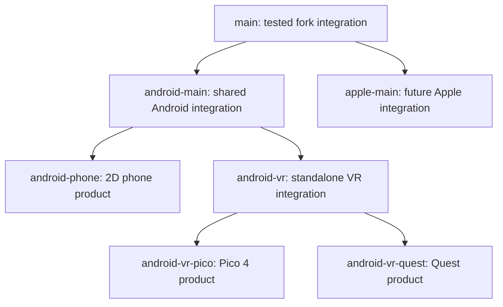

# Android Platform Refactoring Roadmap

> **Status:** Active proposal
>
> **Baseline:** `android-main` at `f0fe27e666080a09dbc78ed2920184feb01be03d`
>
> **Detailed evidence:** [Android Platform Ownership and Boundary Report](ANDROID_PLATFORM_OWNERSHIP.md)

## Project compass

- Build useful clients, not a perfect product taxonomy.
- Prefer one tested implementation over copied Phone/Pico variants.
- Extract only boundaries with a clear contract or a second consumer.
- Keep hardware-free milestones small enough for one hobby maintainer to finish.
- Treat hardware sessions as focused evidence gathering, not a release obligation.
- Preserve working Pico and Phone behavior throughout Quest modernization.

## Target structure



## At a glance

| Milestone | Mode | Priority | Outcome |
|---|---|---:|---|
| A0 — Ownership baseline | 🤖 Autonomous | P0 | Branch and component responsibilities are explicit |
| A1 — First shared Android source | 🤖 Autonomous | P0 | Phone/Pico JNI duplication removed |
| A2 — Immutable capability identity | 🤖 Autonomous | P0 | Settings cannot mistake Phone/Quest for Pico |
| A3 — Shared Android override directory | 🤖 Autonomous | P1 | Phone no longer compiles files from Pico directories |
| V1 — Generic Android-VR test gate | 🤖 Autonomous | P1 | Shared VR changes run one predictable suite |
| V2 — Small OpenXR policy extraction | 🤖 Autonomous | P1 | Vendor-neutral OpenXR policy has one tested home |
| P1 — Phone regression cycle | 🤖 + 📱 | P1 | Phone remains usable through shared refactors |
| PI1 — Pico regression cycle | 🤖 + 🥽 | P1 | Pico remains usable and thermally observable |
| Q0 — Quest direction decision | 👤 + 🥽 | P0 for Quest | Choose modern OpenXR or legacy Oculus maintenance |
| Q1 — Quest modern bootstrap | 🤖 | After Q0 | Modern Gradle/SDK app configures and builds |
| Q2 — Quest runtime acceptance | 🥽 | After Q1 | Tracking, input, audio, world join validated |

Legend: 🤖 hardware-free; 👤 maintainer scope decision; 📱 Android phone; 🥽 standalone headset.

## Milestone A0 — Ownership baseline

**Status:** ✅ Complete on `refactor/android-platform-boundaries`

Deliverables:

- [x] Map Phone, Pico, Quest, legacy Interface, and shared Android targets.
- [x] Map platform macros, selectors, manifests, workflows, and tests.
- [x] Identify cross-product files and product-directory dependencies.
- [x] Define branch-to-component and branch-to-test ownership.
- [x] Record UI/Settings residue and prioritized risks.

Exit condition: future work has a clear starting branch and required gate set.

## Milestone A1 — First shared Android source

**Status:** ✅ Complete on `refactor/android-platform-boundaries`

Deliverables:

- [x] Create `android/shared/src`.
- [x] Move `QtInputConnectionCompat.cpp` to one shared implementation.
- [x] Compile the shared source from Phone and Pico targets.
- [x] Point Phone native tests and Pico platform contracts at the same file.
- [x] Pass Android fast/contracts/host, Pico device-free, native, and project quick suites.

Exit condition: no Phone/Pico duplicate remains and all hardware-free gates pass.

## Milestone A2 — Immutable platform capability identity

**Status:** ✅ Complete on `refactor/android-platform-boundaries`

Objective: replace mutable settings and unrelated behavioral probes with stable
product capabilities.

Deliverables:

- [x] Define the minimum immutable identity needed by Settings (`pico interaction
  available`), with Phone, Quest, Desktop, and unknown products failing closed.
- [x] Expose it through an existing safe scripting/QML boundary rather than a new
  broad global API where possible.
- [x] Replace `deferTabletCreationUntilOpen` as Pico Settings detection.
- [x] Ensure Pico Interaction cannot be constructed on Phone or Quest.
- [x] Add Phone-negative, Quest-negative, Pico-positive, and default-negative tests.
- [x] Pass Android fast/contracts/host, Pico device-free, and project quick suites.

Exit condition: changing a persisted setting cannot change product identity.

## Milestone A3 — Shared Android override directory

**Mode:** 🤖 Autonomous

Objective: remove direct Phone dependencies on Pico-owned source paths.

Deliverables:

- [ ] Review `OffscreenGLCanvas.cpp` behavior against Phone and Pico tests.
- [ ] Move the genuinely shared override under `android/shared`.
- [ ] Update both CMake targets without changing behavior.
- [ ] Replace Pico-named Gradle runtime override ownership where files are shared.
- [ ] Add an architecture contract that rejects cross-product source paths.

Exit condition: Phone CMake/Gradle does not compile or package files from
`picoInterface`, except for explicitly documented temporary runtime artifacts.

## Milestone V1 — Generic Android-VR test gate

**Mode:** 🤖 Autonomous

Deliverables:

- [ ] Add an aggregate `android-vr` hardware-free command.
- [ ] Include generic OpenXR native policies, Pico device-free tests, Quest launcher
  policy, syntax, and module inventory.
- [ ] Keep vendor release/tooling tests in child suites.
- [ ] Document expected runtime and stable JUnit output.
- [ ] Wire the gate to Android-VR integration changes without duplicating every CI job.

Exit condition: an `android-vr` merge has one local command that fails closed.

## Milestone V2 — Small OpenXR policy extraction

**Mode:** 🤖 Autonomous

Do not move the complete Pico plugin first. Choose one policy that has no Pico SDK
dependency, such as extension classification, event-state validation, or space
lifecycle rules.

Deliverables:

- [ ] Prove the selected policy uses only OpenXR/core C++ types.
- [ ] Move it to a neutral Android-VR location.
- [ ] Retain Pico behavior and tests.
- [ ] Add a Quest-facing consumer or explicit future-consumer contract.
- [ ] Repeat only after the pattern stays easy to maintain.

Exit condition: one real OpenXR abstraction is vendor-neutral without a large rename.

## Milestone P1 — Phone regression cycle

**Autonomous portion:** 🤖

- [ ] Run fast, host, contracts, Robolectric, coverage, and emulator gates.
- [ ] Build an installable debug APK with verified 16 KiB dependencies.

**Hardware portion:** 📱

- [ ] Cold launch and permission denial/grant.
- [ ] Open `overte:` and `hifi:` deep links while stopped/backgrounded/foregrounded.
- [ ] Join a domain, move, open tablet apps, mute/unmute, and restart.
- [ ] Record device/API/GPU and any rendering or lifecycle defects.

## Milestone PI1 — Pico regression cycle

**Autonomous portion:** 🤖

- [ ] Run the 30-test Pico suite and project quick suite.
- [ ] Build and verify the Pico APK when dependencies are prepared.

**Hardware portion:** 🥽

- [ ] Launch, recenter, join a domain, move, turn, teleport, and grab.
- [ ] Validate both controllers, haptics, microphone, tablet, and Web entities.
- [ ] Run a bounded thermal/performance session and retain the report.

## Milestone Q0 — Quest direction decision

**Mode:** 👤 maintainer input plus eventual Quest hardware

Recommended default: build a modern Quest target on the shared OpenXR direction and
keep the old Oculus Mobile code as reference until basic parity is demonstrated.

Decision questions:

- Is Quest support personally useful enough to maintain now?
- Is a Quest headset available for repeated sideload/testing?
- Is Meta platform login required, or is normal Overte authentication sufficient?
- Is store distribution a goal, or is sideloading enough?

Exit condition: one written direction prevents simultaneous legacy and OpenXR ports.

## Milestone Q1 — Modern Quest bootstrap

**Mode:** 🤖 Autonomous after Q0

- [ ] Create a modern Gradle 8.13 / Java 17 / current SDK Quest product path.
- [ ] Remove legacy external-storage permissions and implicit exported behavior.
- [ ] Reuse shared Android lifecycle and security policies.
- [ ] Reuse vendor-neutral OpenXR components only.
- [ ] Add package, manifest, launcher, build, and device-free contracts.

Exit condition: a Quest APK configures/builds and passes host contracts; hardware
correctness is explicitly not claimed yet.

## Milestone Q2 — Quest runtime acceptance

**Mode:** 🥽 Hardware required

- [ ] Install and launch from the headset library.
- [ ] Establish OpenXR session, rendering, tracking, and recenter behavior.
- [ ] Validate Touch controllers, locomotion, interaction, haptics, and microphone.
- [ ] Join a real domain and complete a sustained session.
- [ ] Capture logs for runtime/vendor-specific exceptions.

## Work deliberately deferred

- Rewriting Git history to make branches appear physically pure.
- Renaming every Pico class before a second headset consumes it.
- Maintaining both proprietary Oculus Mobile and OpenXR Quest implementations.
- Store publishing, protected signing infrastructure, or formal support promises.
- Large `Application_Setup.cpp` replacement without incremental hooks and tests.
- Apple branch integration before the active iOS work reaches a stable point.

## Recommended execution order

```text
A0 ✅ → A1 → A2 → A3 → V1 → V2
                     ↘ P1 (Phone validation)
                     ↘ PI1 (Pico validation)

Q0 (when hardware/scope are available) → Q1 → Q2
Apple integration proceeds independently after iOS work stabilizes.
```

The next autonomous coding milestone after A2 is A3: move genuinely shared Android
overrides out of Pico-owned paths. It removes existing Phone-to-Pico source coupling
without requiring the full Quest architecture decision.
