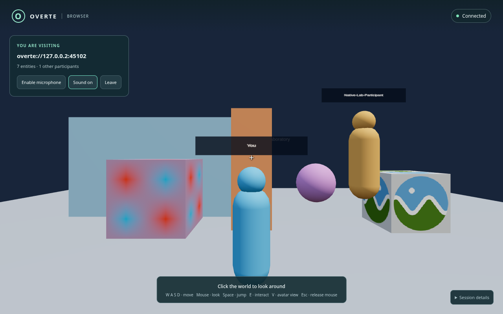
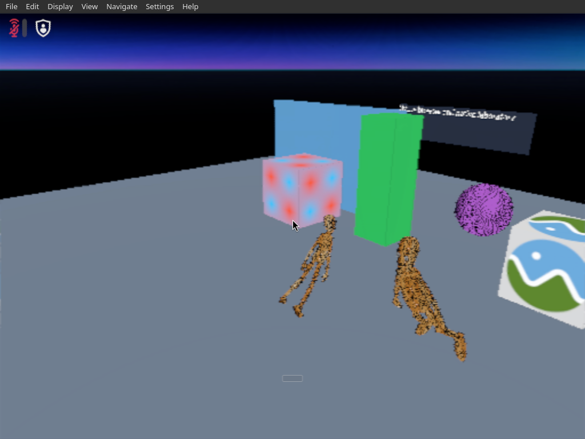

# Browser client verification

These records describe actual local Overte domain/native/browser tests on
2026-09-30. Timestamps are UTC. The original requirement for a 30-minute session
was explicitly cancelled by the user; no endurance result is claimed.

## Environment and reproducible commands

The test host ran Fedora 44, Node.js 24.21.0, Python 3.14.7 and FFmpeg 8.1.2.
The production build and complete 41-test unit suite also passed under Node.js
22.23.3. Browser automation used Playwright 1.63.0 and Puppeteer Core 25.12.0.
The independent Interface, gateway Interface processes and domain/assignment
servers used the pinned official Overte 2026.04.1 release artifacts. Exact
public download URLs and SHA-256 identities are in
[evidence/artifacts.json](evidence/artifacts.json).

The browser rendered real entity/asset data on its own device using WebGL.
Chromium used SwiftShader in automation. Native Interface rendering used an
isolated 1024×768 Xvfb display with a half-resolution viewport; these software
rendering settings keep the native participant visible while sharing CPU
resources with the browser.

From the repository root:

```bash
npm --prefix browser-client ci
npm --prefix browser-client run build
python3 browser-client/lab/manage.py prepare
python3 browser-client/lab/manage.py start --gateway --open-browser
npm --prefix browser-client exec playwright install chromium firefox
node browser-client/tests/integration/real-session.mjs
OVERTE_LAB_BROWSER=firefox node browser-client/tests/integration/real-session.mjs
OVERTE_LAB_BROWSER=system-firefox node browser-client/tests/integration/real-session.mjs
# Optional installed Chromium; use your executable and matching library directory.
OVERTE_LAB_BROWSER=system-chromium OVERTE_LAB_CHROMIUM=/path/to/chromium \
  OVERTE_LAB_CHROMIUM_LIBRARY_PATH=/path/to/chromium/libraries \
  node browser-client/tests/integration/real-session.mjs
node browser-client/tests/integration/assets-and-avatars.mjs
node browser-client/tests/native-denial.mjs
OVERTE_LAB_BROWSER=system-firefox node browser-client/tests/integration/physical-microphone.mjs
```

The usable browser URL is **http://127.0.0.1:8090**. Its actual domain is
`overte://127.0.0.2:45102`; the pinned native release uses the equivalent
`hifi://127.0.0.2:45102` address. The alternative loopback address and domain
server IPC namespace avoid the legacy native client's global localhost-port
discovery interfering with other local test domains. Domain administration has
an automatically generated private password; unauthorized HTTP access returned
401. Startup first uploaded real entities, glTF and binary PNG assets, then
saved and verified identical anonymous/localhost guest permission groups before
starting the gateway. See [managed-start.json](evidence/managed-start.json).

The stock Chromium test used the Fedora executable `chromium-browser/chromium-browser`
and its matching extracted `usr/lib64` dependencies. These selectors apply only
to the browser child process; they do not alter native services. An installed
Chromium with its dependencies on the normal loader path needs only
`OVERTE_LAB_CHROMIUM`.

## Actual journeys

| Browser | UTC start → finish | Result |
| --- | --- | --- |
| Chromium 153.0.8010.12 | 13:49:59.987 → 13:51:25.045 | Passed |
| Bundled Firefox 155.0 | 13:51:36.245 → 13:52:37.610 | Passed |
| Installed Firefox 156.0 | 14:07:34.579 → 14:08:37.206 | Passed |
| Stock Chromium 154.0.8037.57 | 14:47:22.184 → 14:48:26.933 | Passed |

Every journey joined the actual domain alongside an independent native client,
loaded seven actual entities and HTTPS/ATP textured models, synchronized browser
and native movement in both directions, collided with actual world geometry,
changed a shared object's color through interaction, transmitted microphone
audio in both directions, left cleanly, rejoined, moved after reconnect, and
changed view orientation with mouse input. The native client independently
observed the browser position; measured stationary horizontal differences were
below 0.0001 m. Departed browser avatars disappeared from the independent native
client within two seconds in these runs. Each first session remained connected
without unexpected reconnects throughout its journey.

[real-journeys.json](evidence/real-journeys.json) retains timestamps, measured
positions/colors/audio levels and exact tested source/bundle SHA-256 identities.
The stock Chromium 154 journey ran against the final gateway security/lifecycle
source and additionally hashes its permission-policy, validation and process-lifecycle
modules. These are short functional journeys, not endurance tests. Chromium viewport
screenshots use the real CDP surface because its clipped Playwright capture
could stall after pointer lock under SwiftShader. Bundled Firefox uses
Playwright; installed Firefox uses Puppeteer WebDriver BiDi. No rendered world
pixels are substituted.

## Voice and physical microphone evidence

End-to-end playback tests used synthetic input. Chromium captured a generated
440 Hz fake microphone WAV; Firefox used its generated fake microphone signal.
The independent native microphone received a generated 997 Hz tone. Native and
browser playback were captured from separate private PulseAudio null sinks,
with no physical hardware modules. Tests required nonzero signal at the actual
playback outputs and verified the known tones, rather than only counting packets.

| Journey | Browser → native playback RMS | Native → browser playback RMS | Native 997 Hz tone amplitude in browser output |
| --- | --- | --- | --- |
| Chromium 153 | 0.008598 | 0.011618 | 0.009469 |
| Bundled Firefox | 0.008081 | 0.011577 | 0.009505 |
| Installed Firefox | 0.008140 | 0.011635 | 0.009476 |
| Stock Chromium 154 | 0.008640 | 0.011323 | 0.009469 |

A separate installed Firefox 156.0 test at **14:14:48.821–14:15:04.551 UTC**
connected to the real domain and opened a physical ALSA capture device
without fake-media preferences. One non-fake audio track was live, 52 audio
frames were sent at 48 kHz, and muting released the hardware track. See
[physical-microphone-system-firefox.json](evidence/physical-microphone-system-firefox.json).
No device labels, microphone recordings or spoken conversation were saved.
This establishes ALSA capture-device permission, frame-send and mute-release
behavior. The host reports its physical input ports as unavailable, so no
plugged-in microphone or acoustic speech input is confirmed. The bidirectional
playback proof above remains explicitly synthetic.

Chromium's actual hardware preflight at **14:23:50.711–14:23:51.633 UTC**
stopped before connection because the browser exposed zero audio inputs.
[physical-microphone-chromium.json](evidence/physical-microphone-chromium.json)
retains that failure honestly. Further actual probes of Chromium 153 headless
shell, full headless/headful Chrome, and stock Chromium 154 all reported zero
inputs and `NotFoundError`. The host has one physical ALSA capture source with
three ports, all reported unavailable. These sanitized counts are retained in
[microphone-availability.json](evidence/microphone-availability.json).
Chromium's [official PulseAudio implementation](https://chromium.googlesource.com/chromium/src/+/main/media/audio/pulse/audio_manager_pulse.cc)
excludes capture sources whose ports all report unavailable. Firefox can open
the ALSA device despite this status. No connected microphone, acoustic input or
human conversation is claimed; synthetic bidirectional playback passed.

A separate stock Chromium 154 UI test at **14:49:16.081–14:49:30.937 UTC**
used no fake microphone. It displayed “No microphone found. Connect one and
try again.”, kept all seven real entities connected, stayed muted with zero
capture frames, enabled retry, and allowed 0.420 m movement before clean leave.
It emitted no uncaught page errors. See
[microphone-unavailable-ui.json](evidence/microphone-unavailable-ui.json).
On a host with no available Chromium capture input, reproduce this with:

```bash
OVERTE_LAB_CHROMIUM=/path/to/chromium \
  OVERTE_LAB_CHROMIUM_LIBRARY_PATH=/path/to/chromium/libraries \
  node browser-client/tests/integration/microphone-unavailable-ui.mjs
```

## Binary assets, visible participants and refused access

The original checker PNG was uploaded through the real native
`Assets.putAsset(ArrayBuffer)` API. The actual glTF renderer fetched the
relative `atp:/browser-lab/checker.png` texture through the gateway. The downloaded
79 bytes exactly matched SHA-256
`18e1d2c0906dacb97f5f2bee825f1b5714c481c299e9401261ac21c0cf7b903c`.
The full journeys retain their own tested source hashes. The later focused
asset/avatar run at **14:37:21.127–14:37:42.483 UTC** records the final
gateway hash after the sandbox/CSP asset-response security header change; the production browser bundle is unchanged. See
[evidence/assets-and-avatars.json](evidence/assets-and-avatars.json).

The browser image shows its own cyan representation and the named independent
native participant in orange beside the actual models and world geometry. The
native image shows both actual humanoid participants in the same domain.





A separate real domain refused native connection at **13:34:49.332 UTC** because
the visitor lacked Directory Services connection permission. No world data was
exposed. Its administration required authentication, and the entire fixture ran
in an independent IPC namespace. See [native-denial.json](evidence/native-denial.json).
The gateway also validates the managed anonymous permission baseline before
releasing world/assets/audio. Login-required domains remain unsupported and
fail closed; arbitrary public domain compatibility is not claimed.

Portable records omit session/entity UUIDs, private filesystem paths,
credentials, device labels and raw audio. Screenshots retain the actual tested
pixels. Broader unit, browser and repository checks are recorded in
[STATUS.md](STATUS.md).
